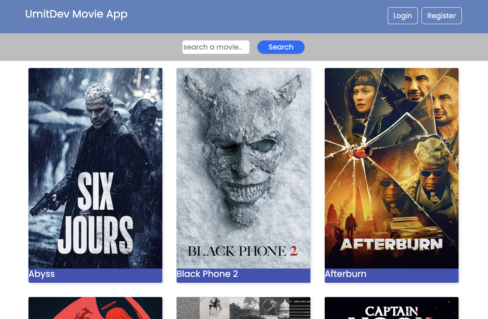
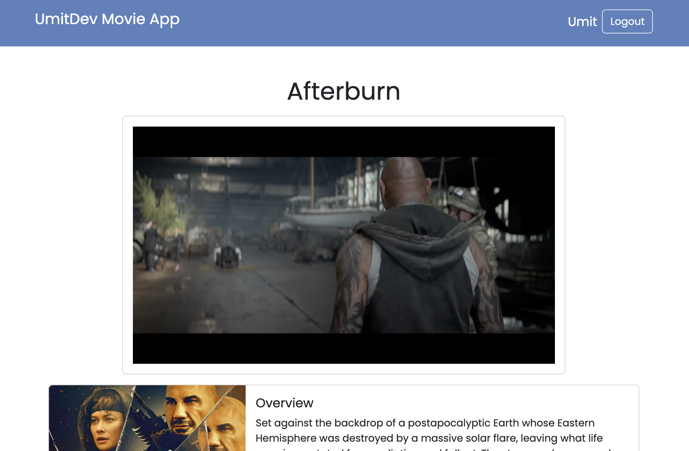
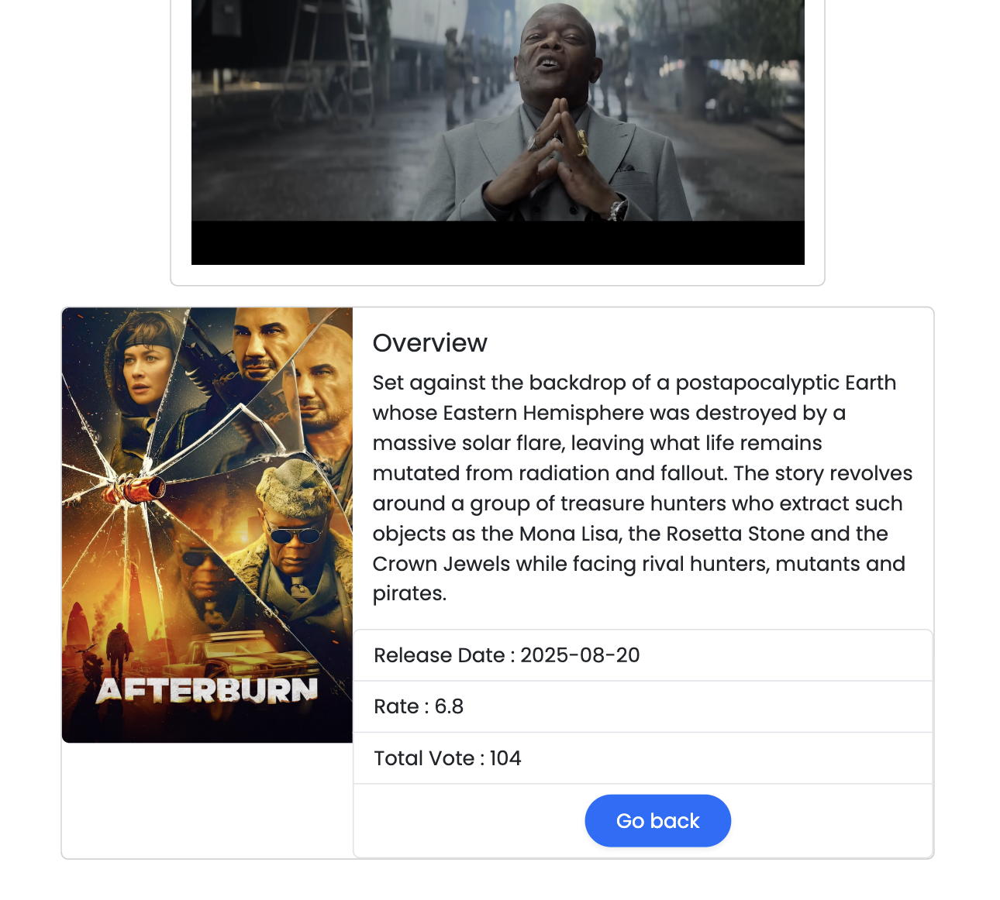

<p align="center">
  
  
  
</p>

<h1 align="center">📌 React Firebase Movie App</h1>

<p align="center">
Discover movies with TMDB API, protected routes, and Firebase authentication.
</p>


<div align="center">
  <h3>
    <a href="https://movie-app-umitdev.netlify.app/">
      🖥️ Live Demo
    </a>
     | 
    <a href="https://github.com/umitarat-dev/Movie-App.git">
      📂 Repository
    </a>
  </h3>
</div>

<p align="center">
  <a href="https://movie-app-umitdev.netlify.app/">
    
  </a>
</p>

## 📚 Navigation

- [✨ Overview](#-overview)
- [📖 Description](#-description)
- [🚀 Features](#-features)
- [🗂️ Project Skeleton](#️-project-skeleton)
- [🛠️ Built With](#️-built-with)
- [⚡ How To Use](#-how-to-use)
- [📌 About This Project](#-about-this-project)
- [🙏 Acknowledgements](#-acknowledgements)
- [📬 Contact Information](#-contact-information)


## ✨ Overview

This React Firebase Movie App allows users to discover popular movies, search for titles, and view detailed movie information using the TMDB API.

The application includes an authentication system powered by Firebase, enabling users to register, log in, and access protected pages. With client-side routing and a responsive UI, it delivers a smooth and modern movie browsing experience across devices.


<div align="center"> 

  
  
  --- 
  
   

  ---
   

</div>
 

## 📖 Description

This project is a modern movie discovery application built with React, Firebase Authentication, and the TMDB API.

Users can create an account or sign in using Firebase authentication, browse popular movies, search for specific titles, and view detailed information such as movie overviews, ratings, and trailers. Certain pages are protected and only accessible to authenticated users through private routing.

The application demonstrates key frontend concepts including:
- Client-side routing with React Router v6
- Authentication and authorization using Firebase
- Global state management with Context API
- API integration and data fetching with Axios
- Responsive UI design for mobile and desktop devices


## 🚀 Features

* ⚛️ **React Router v6** ile client-side routing
* 🔐 **PrivateRouter** ile korumalı sayfa yapısı
* 🔥 **Firebase Authentication** (Email/Password + Google Auth)
* 🎞️ **TMDB API** ile film listeleme ve arama
* 💬 **Toastify** bildirimleri
* 📱 **Mobil uyumlu tasarım**
* 🧠 **Context API** ile global authentication yönetimi
* 🚀 Netlify üzerinde canlı demo
  

## 🗂️ Project Skeleton

```
src/
 │
 |----readme.md   
 │
 ├─ auth/
 │   └─ firebase.js
 │   
 ├─ components/
 │   ├─ MovieCard.jsx
 │   ├─ Navbar.jsx
 │   └─ VideoSection.js
 │   
 ├─ context/
 │   └─ AuthContext.jsx
 │   
 ├─ helpers/
 │   └─ ToastNotify.js
 │   
 ├─ pages/
 │   ├─ Login.jsx
 │   ├─ Main.jsx
 │   ├─ MovieDetail.jsx
 │   └─ Register.jsx
 │   
 ├─ router/
 │   └─ AppRouter.jsx
 │   
 ├─ App.js
 ├─ İndex.css
 └─ index.js
```


## 🛠️ Built With

- [⚛️ React](https://react.dev/)  
- [🔥 Firebase](https://firebase.google.com/)
- [🧭 React Router v6](https://reactrouter.com/) 
- [🎨 Bootstrap5](https://getbootstrap.com/)
- [🔧 Axios](https://axios-http.com/docs/intro) 
- [💬 React-Toastify](https://fkhadra.github.io/react-toastify/introduction/)
- [🎬 TMDB API](https://developer.themoviedb.org/docs/getting-started) 
- [🌐 Netlify](https://www.netlify.com/)


## ⚡ How To Use

🔸 To clone and run this application, you'll need [Git](https://git-scm.com/), [Node.js](https://nodejs.org/), and a package manager (`yarn` or `npm`) installed on your computer.

```bash
# Clone this repository
$ git clone https://github.com/umitarat-dev/Movie-App.git

# Navigate into the project folder
$ cd Movie-App

# Install dependencies
yarn  
yarn start

# or using npm
npm install
npm start
```
🔸 Then open http://localhost:3000 to view it in your browser.


## 📌 About This Project

🔸 Bu proje temel React yeteneklerini, Firebase Authentication kullanımını ve 3rd party API entegrasyonunu pekiştirmek amacıyla geliştirilmiştir.

🔸 Ayrıca;

* Component mimarisi
* Context API ile global state yönetimi
* Protected route mantığı
* Responsive tasarım
* Bildirim sistemi

gibi konuları pratik etmek için güzel bir örnek uygulamadır.


## 🙏 Acknowledgements

- [🎓Clarusway](https://clarusway.com/) – for the training resources
- [📘React Documentation](https://react.dev/)
- [🔥 Firebase Docs](https://firebase.google.com/)
- [🧭React Router Docs](https://reactrouter.com/en/main/start/overview)
- [💬 React-Toastify Docs](https://fkhadra.github.io/react-toastify/introduction/)
- [🎬 TMDB API Docs](https://developer.themoviedb.org/docs/getting-started) 
- [🌐 Netlify Docs](https://www.netlify.com/)


## 📬 Contact Information

I am always open to discussing new projects, creative ideas, or opportunities to be part of your visions.

* **LinkedIn:** [linkedin.com/in/umit-arat](https://www.linkedin.com/in/umit-arat/)
* **Email:** [umitarat8098@gmail.com](mailto:umitarat8098@gmail.com)
* **GitHub:** [github.com/umitarat-dev](https://github.com/umitarat-dev) (Current Workspace)